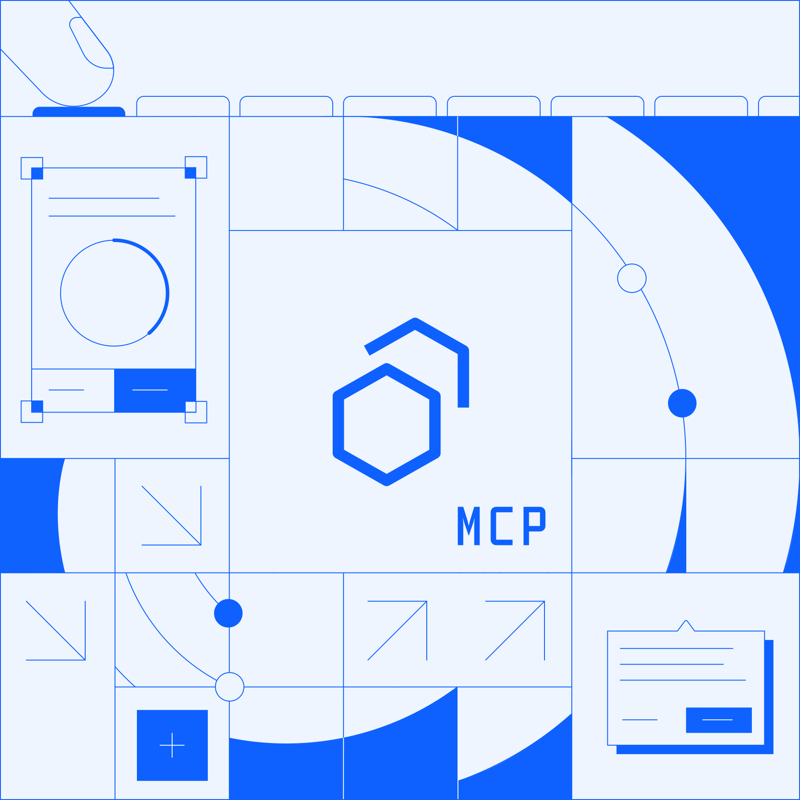

# Carbon MCP

## What is MCP?

MCP (Model Context Protocol) is an open-source standard that enables AI agents or AI applications to securely connect with external tools, data sources, and workflows through a unified integration layer.

## Why Carbon MCP?

- _Instant AI Access to Carbon Design Standards_:
Carbon MCP lets AI applications or agents directly query the Carbon design system for pertinent context (e.g. colors, typography, component source, usage guidelines, etc.).

- _Smarter Code Generation_:
Code examples and documentation exposed via Carbon MCP allows AI tools to generate high-fidelity Carbon UI code that conforms to design and development best practices.

- _Improved Consistency_:
AI tools that integrate Carbon MCP gives designers, developers, and PMs consistent answers and examples from a shared source of truth, helping reduce drift and rework.
