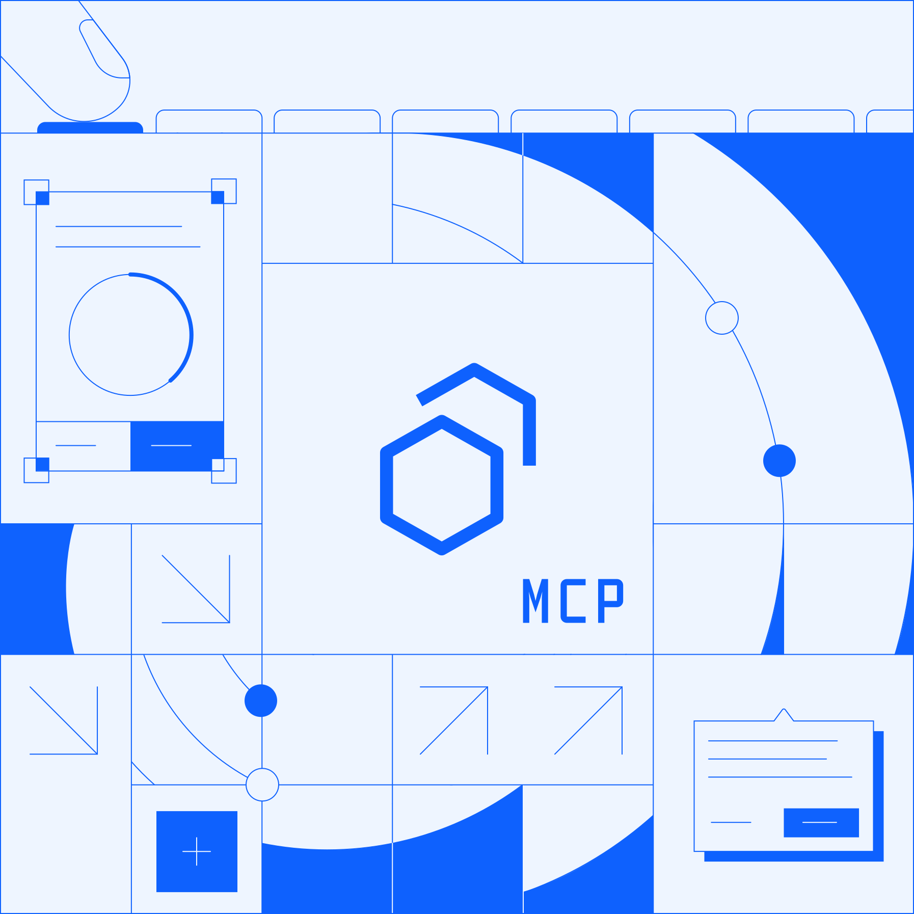

# Carbon MCP - issue tracking

This repository serves as the central place to report issues and request new features for Carbon MCP. 

Visit the Carbon MCP website to get started: 

- [Overview](https://carbondesignsystem.com/developing/carbon-mcp/overview/): MCP overview, Carbon MCP tools and content coverage
- [Onboarding and setup](https://carbondesignsystem.com/developing/carbon-mcp/onboarding-and-setup/): Getting authentication credentials and connecting to common MCP clients
- [Prompts](https://carbondesignsystem.com/developing/carbon-mcp/prompts/): Prompting guidance and examples

 

## What is MCP?

MCP (Model Context Protocol) is an open-source standard that enables AI agents or AI applications to securely connect with external tools, data sources, and workflows through a unified integration layer.

## Carbon MCP

➤ **Carbon MCP makes any agentic AI application an instant expert in the Carbon Design System, enabling teams to deliver consistent, high‑quality user experiences with greater speed.**

- _Instant AI Access to Carbon Design Standards_:
Carbon MCP lets AI applications or agents directly query the Carbon design system for pertinent context (e.g. colors, typography, component source, usage guidelines, etc.).

- _Smarter Code Generation_:
Code examples and documentation exposed via Carbon MCP allows AI tools to generate high-fidelity Carbon UI code that conforms to design and development best practices.

- _Improved Consistency_:
AI tools that integrate Carbon MCP gives designers, developers, and PMs consistent answers and examples from a shared source of truth, helping reduce drift and rework.

## Summary of Carbon MCP Coverage

Carbon MCP continues to evolve. Current coverage is provided below:

#### ✅ `@carbon/react`
- Code examples and documentation
- Example: Button, Tabs, TextInput, etc.
- Multiple variants per component
- Complete props and imports

#### ✅ `@carbon/web-components`
- Code examples and documentation
- Example: button, tabs, text-input, etc.
- Multiple variants per component
- Complete props and imports

#### ✅ Carbon for IBM Products
- Code examples and documentation
- Example: Tearsheets, PageHeader, etc.
- Multiple variants per component
- Complete props and imports

#### ✅ Carbon Icons and Pictograms
- Code examples and documentation
- Example: Settings, User, UserAvatarFilled, etc.
- Usage

#### ✅ `@carbon/ai-chat`
- Code examples and documentation
- Example: basic, custom-element, history, etc.
- Full code examples
- Complete props and imports

#### ✅ `@carbon/charts`
- Chart type descriptions
- Links to demos
- Full code examples
- Complete props and imports

#### ✅ `@carbon-labs/*`

- Code examples and documentation for preview candidates
  - React - AnimatedHeader, Processing, Resizer, UIShell, and What's New
- Multiple variants per component
- Complete props and imports

#### ⛔ Support coming soon!

- Carbon TanStack
- Carbon Patterns
